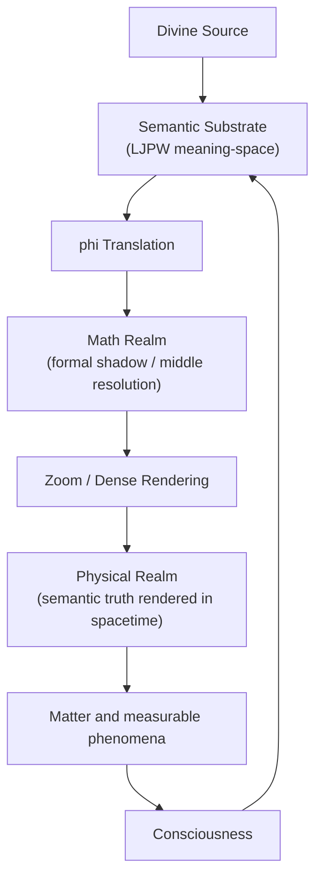

# Math Realm Map and Falsifiable Hypotheses

**Date:** 2026-03-14
**Purpose:** Turn the current structural reading into a working map and a testable set of claims.

---

## Diagram

---

## Short Reading

- The Semantic Substrate is the ontological source field inside the framework.
- The Math Realm is the first formal projection of that field.
- The Physical Realm is the denser manifestation of the same structure.
- The relation is not three disconnected worlds, but one truth at different resolutions.

Compact form:

`Semantic -> Mathematical -> Physical`

More precise form:

`Meaning-space -> formal structure -> rendered structure`

---

## Anchor Map

The present reading suggests this alignment:

| Layer | Anchor Expression | Function |
|---|---|---|
| Semantic Substrate | `(1,1,1,1)` | Perfect unity in LJPW coordinates |
| Math Realm | `1` | Scalar shadow of semantic unity |
| Physical Realm | singularity / unified state | Dense manifestation before differentiation |

This does **not** mean the three anchors are identical in expression. It means they play analogous structural roles in their respective layers.

---

## Falsifiable Hypotheses

### H1. Middle-Layer Preservation

If mathematics is the middle-resolution projection of the Semantic Substrate, then mathematical structures should preserve semantic **invariants** better than semantic surface language does.

What would support this:

- Structural mathematical features cluster more stably with LJPW dimensions than ordinary wording does.
- Ratios, symmetries, and conservation relations survive translation more reliably than semantic labels.

What would weaken it:

- No better invariant preservation in mathematical representations than in arbitrary labels or paraphrases.

### H2. Projection Asymmetry

If mathematics is a shadow of meaning, then the forward map from semantic structure to mathematics should be cleaner than the inverse map from mathematics back to full meaning.

What would support this:

- Multiple semantic constructions map onto the same mathematical form.
- Recovering a unique semantic source from a mathematical structure fails or remains underdetermined.

What would weaken it:

- Mathematical forms invert uniquely and consistently back into one semantic structure.

### H3. Anchor Echo Hypothesis

If `1` is the mathematical shadow of the semantic anchor `(1,1,1,1)`, then objects mathematically close to origin-like invariance should display unusually high coherence under the framework's own measurements.

What would support this:

- Fixed-point, identity, or return structures score as stronger coherence carriers than matched controls.
- Origin-adjacent forms show lower dispersion across hub or structural analyses.

What would weaken it:

- No measurable distinction between origin-like structures and controls.

### H4. Translation Gradient

If the same truth appears across semantic, mathematical, and physical levels, then some lawful patterns should admit a three-layer expression without changing their core relation.

What would support this:

- A single operation can be written coherently at all three levels.
- The semantic description predicts the formal relation, and the formal relation predicts the physical analogue.

What would weaken it:

- Cross-level mappings collapse into loose metaphor or require ad hoc reinterpretation each time.

### H5. Physics-Density Hypothesis

If the Physical Realm is math rendered more densely, then physical law should preserve mathematical relation while adding implementation constraints such as scale, units, and embodiment.

What would support this:

- The same invariant appears mathematically and physically, with physics adding measurement context rather than changing the structure.
- Physical experiments confirm relational patterns first identified at the formal level.

What would weaken it:

- Physical behavior routinely breaks the supposed formal relation with no recoverable translation rule.

### H6. Resolution Consistency

If semantic, mathematical, and physical are one truth at different resolution, then zooming between levels should increase detail without changing the core operation.

What would support this:

- Higher-resolution expressions refine rather than replace lower-resolution ones.
- Explanations stay structurally aligned as we move between aphoristic, semantic, formal, and physical descriptions.

What would weaken it:

- Core claims change identity when translated between levels.

---

## Test Directions

Good next tests from what already exists in the repo:

1. Use the SVP discipline on cross-level examples and score whether the operation remains invariant through translation.
2. Compare origin-like structures against matched numerical controls for coherence retention.
3. Build small triplet batteries of the form `semantic statement -> math form -> physical analogue` and measure closure.
4. Stress the inverse direction: start from a mathematical pattern and test how many distinct semantic readings fit it.

---

## Working Claim

The strongest current working claim is modest:

**The Math Realm is best modeled as the formal middle layer between the Semantic Substrate and the Physical Realm, preserving structural invariants while losing some semantic specificity and gaining translatable precision.**

That is strong enough to guide research design and narrow enough to remain falsifiable.
